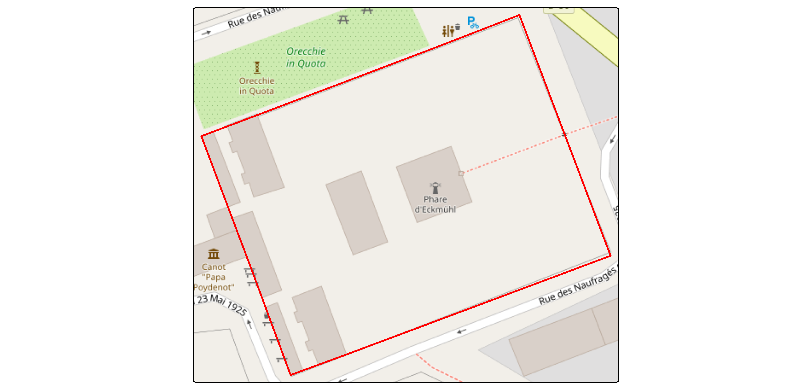
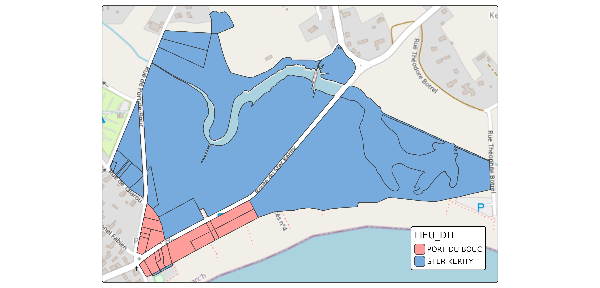

# Parcelles Cadastrales (FR)

``` r
library(Rsequoia2)
#> Attempting to load the package cache ... No cache found.
#> Will try to reconfigure qgisprocess and build new cache ...
library(tmap)
library(openxlsx2)
library(sf)
#> Linking to GEOS 3.12.1, GDAL 3.8.4, PROJ 9.4.0; sf_use_s2() is TRUE
```

Cette vignette montre comment récupérer des parcelles cadastrales avec
`Rsequoia2`.

## Fonctionnement

`Rsequoia2` permet de télécharger les parcelles cadastrales à partir de
leur IDU à l’aide de la fonction
[`get_parca()`](https://sequoiapp.github.io/Rsequoia2/reference/get_parca.md).

*Remarque :* L’IDU est un code à 14 caractères qui identifie de manière
unique une parcelle cadastrale en France.

Il est composé :

- du code département (2 caractères)
- du code commune (3 caractères)
- du préfixe (3 caractères)
- de la section (2 caractères)
- du numéro de parcelle (4 caractères)

Par exemple : `29158000AX0696`

- `"29"` -\> Code du département (2 chiffres)  
- `"158"` -\> Code de la commune (3 chiffres)  
- `"000"` -\> Préfixe / code abs (3 chiffres)  
- `"AX"` -\> Section (2 caractères)  
- `"0696"` -\> Numéro de parcelle (4 chiffres)

``` r
idu <- c("29158000AX0696") 

cp <- get_parca(idu)

tm_tiles("OpenStreetMap")+
tm_shape(cp)+
  tm_borders(col = "red", lwd = 2)+
tm_layout(bg = F)
```



[`get_parca()`](https://sequoiapp.github.io/Rsequoia2/reference/get_parca.md)
est vectorisé donc plusieurs idu peuvent être fournis.

``` r
idus <- paste0("29158000AX0", 696:704)

cp <- get_parca(idus)

tm_tiles("OpenStreetMap")+
tm_shape(cp)+
  tm_borders(col = "firebrick", lwd = 2)
```


## BDP et lieux-dits

[`get_parca()`](https://sequoiapp.github.io/Rsequoia2/reference/get_parca.md)
propose deux arguments : `bdp_geom` et `lieu_dit`.

### `bdp_geom` - BD Parcellaire

La BDP (Base de Données Parcellaire) est un ancien produit de l’IGN qui
n’est aujourd’hui plus maintenu.

Elle a été initialement construite à partir des parcelles cadastrales
Etalab, mais de nombreuses géométries ont été corrigées manuellement par
l’IGN afin de mieux correspondre aux limites observées sur le terrain.

L’utilisation de la BDP peut ainsi améliorer la précision géométrique,
sans toutefois garantir une correspondance parfaite avec les limites
cadastrales légales.

Pour utiliser les géométries issues de la BDP avec
[`get_parca()`](https://sequoiapp.github.io/Rsequoia2/reference/get_parca.md),
définissez l’argument `bdp_geom = TRUE`. Lorsque la géométrie BDP existe
pour un IDU donné, elle remplace automatiquement la géométrie Etalab
correspondante.

``` r
idus <- paste0("545400000C0", 101:109)

etalab <- get_parca(idus, bdp_geom = FALSE)
bdp <- get_parca(idus, bdp_geom = TRUE)
#> ℹ Downloading BDP from IGN...
#> ✔ 9 of 9 ETALAB geom successfully replaced with BDP geom.

tm_tiles("OpenStreetMap")+
tm_shape(etalab)+
  tm_borders(col = "firebrick", lwd = 2)+
tm_shape(bdp)+
  tm_borders(col = "blue", lwd = 2)
```


### `lieu-dit` - Lieu-dit

Un lieu-dit est un nom de localisation associé à une parcelle
cadastrale. Bien qu’il ne soit pas indispensable pour les traitements
cadastraux, il est souvent utile pour vérifier que les parcelles
récupérées correspondent bien à la zone géographique attendue.

Par défaut, les parcelles cadastrales Etalab ne contiennent pas
l’information de lieu-dit. Cependant, un jeu de données existe, et
[`get_parca()`](https://sequoiapp.github.io/Rsequoia2/reference/get_parca.md)
permet d’intersecter cette couche lorsque que `lieu-dit = TRUE`

\*/!\* : cette jointure spatiale peut être relativement longue pour un
grand nombre de parcelles.

``` r
idus <- paste0("29158000BD00", c(10:12, 14:19, 21:25, 29, 31:36, 38, 39, 41, 43:60))

with_lieu_dit <- get_parca(idus, lieu_dit = TRUE)
#> ℹ Downloading and joining Lieux dits...
#> ✔ Lieux dits joined.

tm_tiles("OpenStreetMap")+
tm_shape(with_lieu_dit)+
  tm_polygons(
    fill = "LIEU_DIT",
    fill.legend = tm_legend(position = c("right", "bottom")))
```



## Fonctionnement dans un processus Sequoia

Comme présenté précédemment,
[`get_parca()`](https://sequoiapp.github.io/Rsequoia2/reference/get_parca.md)
permet de récupérer directement les parcelles cadastrales à partir de
leur IDU. Cependant, renseigner manuellement tous les IDU dans R est
souvent peu pratique, et les utilisateurs de Sequoia travaillent
rarement directement avec ces identifiants.

À la place, les parcelles cadastrales sont définies à partir d’une
matrice Excel Sequoia (`*_matrice.xlsx`), et la fonction
[`seq_parca()`](https://sequoiapp.github.io/Rsequoia2/reference/seq_parca.md)
récupère automatiquement l’ensemble des parcelles à partir de cette
matrice.

Un workflow typique est donc le suivant :

- Créer ou compléter la matrice Excel ;
- Appeler
  [`seq_parca()`](https://sequoiapp.github.io/Rsequoia2/reference/seq_parca.md)
  ;
- Laisser Sequoia gérer automatiquement le reste.

### 1. Création de la matrice Excel

La matrice Excel doit contenir les colonnes suivantes :

- **IDENTIFIANT** : Identifiant de la forêt (généralement le nom de la
  forêt)
- **PROPRIETAIRE** : Nom du propriétaire
- **INSEE** : Code INSEE de la commune
- **PREFIXE** : Préfixe cadastral
- **SECTION** : Section cadastrale
- **NUMERO** : Numéro de parcelle
- **LIEU_DIT** : Nom du lieu-dit (optionnel)

**Règles à respecter :**

- Le nom du fichier doit se terminer par `_matrice.xlsx`
- Un seul fichier `*_matrice.xlsx` doit être présent dans le répertoire
  Sequoia
- La matrice doit contenir un seul IDENTIFIANT unique

Afin d’éviter toute erreur de format, vous pouvez générer une matrice
vide avec :

``` r
my_forest_dir <- file.path(tempdir(), "MY_FOREST")
dir.create(my_forest_dir)

matrice_path <- create_matrice(my_forest_dir, id = "MY_FOREST")
#> ✔ Excel file created at: /tmp/Rtmp7d5c8d/MY_FOREST/MY_FOREST_matrice.xlsx
```

### 2. Récupération des parcelles avec Sequoia

Une fois la matrice préparée, l’ensemble du processus cadastral est pris
en charge par
[`seq_parca()`](https://sequoiapp.github.io/Rsequoia2/reference/seq_parca.md).

Cette fonction :

- Lit la matrice Excel ;
- Construit les IDU à partir des informations de la matrice ;
- Télécharge les parcelles cadastrales : la géométrie BDP est utilisée
  lorsqu’elle est disponible (`bdp_geom = TRUE`) ;
- Récupère les lieux-dits manquants (`lieu_dit = TRUE`) ;
- Remplace la matrice initiale par le résultat dans le répertoire
  Sequoia ;
- Créer une sauvegarde de la matrice initiale

Pour illustrer ce workflow, une matrice exemple est fournie dans
`Rsequoia2`.

#### Étape 1 - Créer un répertoire Sequoia et y copier la matrice exemple

``` r
matrice <- read_xlsx(system.file("extdata/ECKMUHL_matrice.xlsx", package = "Rsequoia2"))

sequoia_dir <- file.path(tempdir(), "ECKMUHL")
dir.create(sequoia_dir)

write_xlsx(matrice, file.path(sequoia_dir, "ECKMUHL_matrice.xlsx"))
```

#### Étape 2 - Exécuter `seq_parca()` et charger les parcelles

``` r
parca_path <- seq_parca(sequoia_dir)
#> ℹ Downloading BDP from IGN...
#> ✔ 9 of 9 ETALAB geom successfully replaced with BDP geom.
#> ✔ No area inconsistencies (cadastre vs GIS) detected.
#> ✔ Layer "v.seq.parca.poly" with 9 features saved to 1_SEQUOIA/ECKMUHL_SEQ_PARCA_poly.gpkg.
#> ✔ Table "x.seq.matrice" saved to ECKMUHL_MATRICE.xlsx.
#> ✔ UA also saved as ECKMUHL_matrice_20260217T192217.xlsx for safety.

# lecture directe depuis le chemin retourné
parca <- read_sf(parca_path)

# ou utilisation de seq_read avec un répertoire personnalisé
parca <- seq_read("parca", dirname = sequoia_dir)

tm_tiles("OpenStreetMap") +
tm_shape(parca) +
  tm_borders(col = "firebrick", lwd = 2)
```


