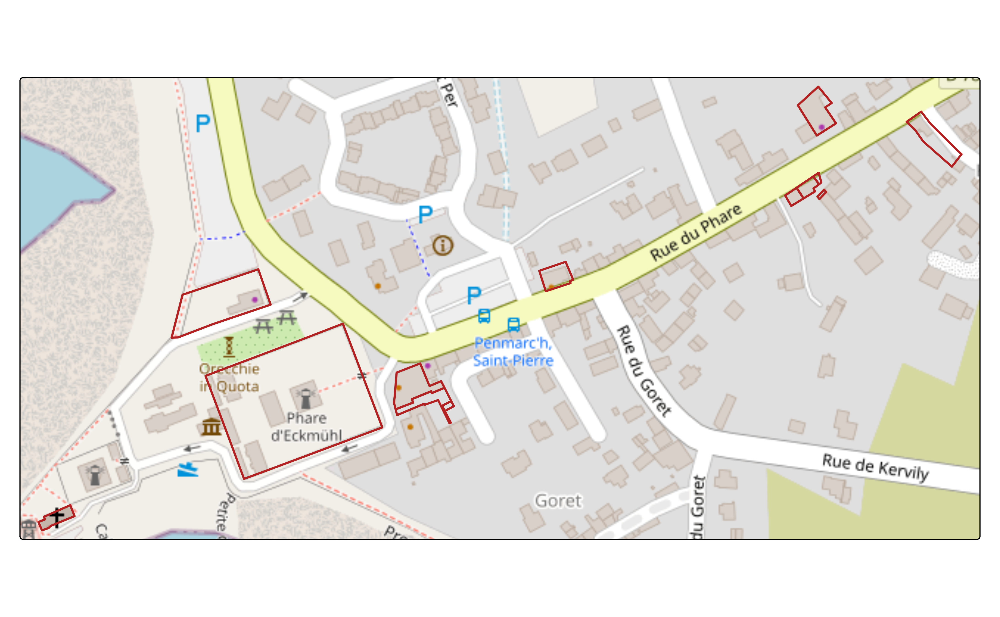

# Cadastral parcels - legal entity

``` r
knitr::opts_chunk$set(
  collapse = TRUE,
  out.width = "100%",
  dpi = 300,
  fig.width = 7.2916667,
  comment = "#>"
)
```

``` r
library(Rsequoia2)
#> Attempting to load the package cache ... No cache found.
#> Will try to reconfigure qgisprocess and build new cache ...
library(tmap)
library(openxlsx2)
library(sf)
#> Linking to GEOS 3.12.1, GDAL 3.8.4, PROJ 9.4.0; sf_use_s2() is TRUE
```

As always, we need to setup a Sequoia dir (temporary in this case)

``` r
seq_dir <- file.path(tempdir(), "MY_FOREST")
dir.create(seq_dir)
```

## What is Legal Entity.

In France, legal entity is known as “Personne morale”. Unlike a physical
person, a legal entity has its own juridical existence and is identified
by national codes such as SIREN or SIRET. In Forestry, typical entities
include “groupements forestiers” or companies.

France provides open datasets that describe all cadastral parcels owned
by legal entities. These files, published by the \***Direction Générale
des Finances Publiques** (DGFiP), allow users to retrieve cadastral
parcels for a given owner.

`Rsequoia2` give acces to this dataset and helpers to search specific
owner.

### Retrieve legal entity owner

[`get_legal_entity()`](https://mucau.github.io/Rsequoia2/reference/get_legal_entity.md)
function download and prepare data as a Sequoia matrice.

There is a cache system to this function to avoid downloading each time.
By default `cache = NULL` which downlaod data in a dedicated cache dir
(see [`tools::R_user_dir()`](https://rdrr.io/r/tools/userdir.html)).

You should keep this directory but if for any reason you need raw data
elsewhere use `cache` arg.

Be aware that you can load data from a department code or an insee code.
The first can be a bit time-consuming but you can then search all
selected dep(s) if owner have cadastral parcels accros multiple commune.

``` r
# cp: cadastrals parcels
insee <- c("29158", "29165")

legal_entity_cp <- get_legal_entity(insee)
#> ℹ Downloading legal entity datasets...
#> ⠙ 15 extracted | 696 MB (259 MB/s) | 2.7s
#> ⠹ 44 extracted | 1.6 GB (278 MB/s) | 5.7s
#> ⠙ 2 extracted |  95 MB ( 43 MB/s) | 2.2s
#> ⠹ 18 extracted | 670 MB (129 MB/s) | 5.2s
#> ⠸ 40 extracted | 1.6 GB (197 MB/s) | 8.2s
#> ✔ Data available at: /home/runner/.cache/R/Rsequoia2
#> ℹ Reading CSV files...
#> ℹ Preparing CSV files...
#> ℹ Generating matrice...
#> ✔ Matrix successfully generated (2329 rows).

head(legal_entity_cp)
#>   IDENTIFIANT         PROPRIETAIRE            IDU  REG_NOM REG_CODE   DEP_NOM
#> 1        <NA>    LES TERRES BLEUES 29158000AB0005 BRETAGNE       53 FINISTERE
#> 2        <NA>    LES TERRES BLEUES 29158000AB0006 BRETAGNE       53 FINISTERE
#> 3        <NA>    LES TERRES BLEUES 29158000AB0007 BRETAGNE       53 FINISTERE
#> 4        <NA>    LES TERRES BLEUES 29158000AB0008 BRETAGNE       53 FINISTERE
#> 5        <NA> TI PORZH LES ROCHERS 29158000AB0011 BRETAGNE       53 FINISTERE
#> 6        <NA>         L ATELIER 89 29158000AB0025 BRETAGNE       53 FINISTERE
#>   DEP_CODE  COM_NOM COM_CODE INSEE PREFIXE SECTION NUMERO              LIEU_DIT
#> 1       29 PENMARCH      158 29158     000      AB   0005          DES GOELANDS
#> 2       29 PENMARCH      158 29158     000      AB   0006           DES EMBRUNS
#> 3       29 PENMARCH      158 29158     000      AB   0007         SAINT GUENOLE
#> 4       29 PENMARCH      158 29158     000      AB   0008          DES GOELANDS
#> 5       29 PENMARCH      158 29158     000      AB   0011         ROGER QUINIOU
#> 6       29 PENMARCH      158 29158     000      AB   0025 PIERRE ET JEAN DUPOUY
#>   SURF_SIG SURF_CAD
#> 1       NA   0.0370
#> 2       NA   1.2358
#> 3       NA   0.0097
#> 4       NA   0.0765
#> 5       NA   0.0339
#> 6       NA   0.0237
#>                                                                                                             SOURCE
#> 1 https://data.economie.gouv.fr/api/v2/catalog/datasets/fichiers-des-locaux-et-des-parcelles-des-personnes-morales
#> 2 https://data.economie.gouv.fr/api/v2/catalog/datasets/fichiers-des-locaux-et-des-parcelles-des-personnes-morales
#> 3 https://data.economie.gouv.fr/api/v2/catalog/datasets/fichiers-des-locaux-et-des-parcelles-des-personnes-morales
#> 4 https://data.economie.gouv.fr/api/v2/catalog/datasets/fichiers-des-locaux-et-des-parcelles-des-personnes-morales
#> 5 https://data.economie.gouv.fr/api/v2/catalog/datasets/fichiers-des-locaux-et-des-parcelles-des-personnes-morales
#> 6 https://data.economie.gouv.fr/api/v2/catalog/datasets/fichiers-des-locaux-et-des-parcelles-des-personnes-morales
```

### Search legal entity owner

After loading the file you can use helpers
[`search_legal_entity()`](https://mucau.github.io/Rsequoia2/reference/search_legal_entity.md).

This helpers relies on a text–normalization applied to both the inputs
and the corresponding columns of the matrice. This makes the search
robust to accents, punctuation, spacing irregularities and case
differences.

Below we search all GFA (“Groupement Foncier Agricole”).

``` r
search_mat <- search_legal_entity(legal_entity_cp, prop = "gfa")

unique(search_mat$PROPRIETAIRE)
#> [1] "GFA DE LA TORCHE" "GFA ADPF"
```

[`search_legal_entity()`](https://mucau.github.io/Rsequoia2/reference/search_legal_entity.md)
can also support multiple search pattern:

``` r
search_mat <- search_legal_entity(legal_entity_cp, prop = c("conservatoire", "espace", "naturel"))

unique(search_mat$PROPRIETAIRE)
#> [1] "CONSERVATOIRE DE L ESPACE LITTORAL ET DES RIVAGES LACUSTRES"
#> [2] "CONSERVATOIRE DE L'ESPACE LITTORAL ET DES RIVAGES LACUSTRES"
#> [3] "SCI ESPACE INTERIEUR"
```

Finally, `lieu_dit` can also be seached:

``` r
search_mat <- search_legal_entity(legal_entity_cp, lieu_dit = "phare")

unique(search_mat[,c("PROPRIETAIRE", "LIEU_DIT")])
#>                                     PROPRIETAIRE LIEU_DIT
#> 692                                  LA VOILERIE DU PHARE
#> 696                   379 RUE DU PHARE -PENMARCH DU PHARE
#> 707 ETAT PAR DIRECTION DE L IMMOBILIER DE L ETAT DU PHARE
#> 710                          COMMUNE DE PENMARCH DU PHARE
#> 715                                       ECKMUL DU PHARE
#> 720                                     VINCEAUR DU PHARE
#> 745                     SCI BOULANGERIE COAT PIN DU PHARE
#> 749                               BRISE DU LARGE DU PHARE
#> 768                               SCI PLOUGONVEN DU PHARE
```

### Save to start Sequoia process

Note that *the legal entity dataset doesn’t provide geometry !* It’s
used to generate an excel matrice (“\*\_matrice.xlsx”) to start a
Sequoia process.
[`seq_xlsx()`](https://mucau.github.io/Rsequoia2/reference/seq_xlsx.md)
function can be used to generate it.

Notice that the `data.frame` generated with
[`get_legal_entity()`](https://mucau.github.io/Rsequoia2/reference/get_legal_entity.md)
is already formated for Sequoia process. This mean you have the
`"IDENTIFIANT"` columns. To avoid filling it in excel, we encouraged you
to do it before saving.

``` r
id <- "MY_FOREST"
search_mat$IDENTIFIANT <- id

seq_write(
  x = search_mat,
  key = "matrice",
  dirname = seq_dir,
  id = id
)

seq_parca(seq_dir)
#> ℹ Downloading BDP from IGN...
#> ⠙ iterating 1 done (0.44/s) | 2.3s
#> iterating ■■■■■■■■■■■■■■■■■■■■■■■■■■■■■■■  100% | ETA:  0s
#> ✔ 12 of 13 ETALAB geom successfully replaced with BDP geom.
#> ✔ No area inconsistencies (cadastre vs GIS) detected.
#> ✔ Layer "v.seq.parca.poly" with 13 features saved to 1_SEQUOIA/MY_FOREST_SEQ_PARCA_poly.geojson.
parca <- seq_read("parca", seq_dir)

tm_tiles("OpenStreetMap")+
tm_shape(parca)+
  tm_borders(col = "firebrick", lwd = 2)
```


